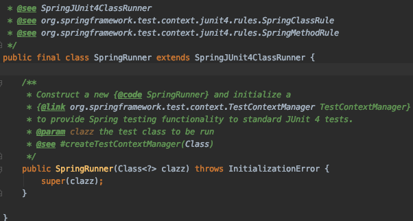

# YMAL基本语法与手写springboot测试类
##### 作者:coresu  
##### 时间:2019-10-29  


### 一、YMAL基本语法  

ymal文件：  

* 使用键值对（Key-Value）的格式书写   
* 以空格缩进控制层级关系，左侧对齐（处于一列）的数据便属于同一级别
* ymal的属性或值大小写敏感 
* 冒号后边的一个空格不可省略  
* yaml文件可以使用ymal或yml结尾

EXAMLPLE：
```
server:
  port: 1521
  path: /hello   
father: 
  child1: HAHA
  child2: DADA
```  
如例子中给出，father与sever处于同一层级，因此级别相等。


### ymal中值   
#### 值的类型：   
- 既可以是简单数据类型，如：数字，字符，布尔，在这里我们简称字面量；     
- 也可以是复合数据类型，如：对象，数组等。

#### 值的字面量：

- K-V字面量可以直接写    
- 字符串默认不用加上单引号或者双引号   
- 双引号在遇到转义字符时，提供转义字符功能  
- 单引号在遇到准义字符时不提供准转义功能，原样输出。   

#### 复合数据类型：  

- 对象与MAP仍然采用（属性和值）K-V的方式书写   

EXAMLPLE：
```
father1:
  CHIELD1: WANGWU
  CHIILD2: WANGER
``` 
如例子中给出的，父亲father1对象有两个属性，属性一儿子CHIELD1: WANGWU，属性二儿子CHIILD2: WANGER   

##### 行内写法:friends:{CHIELD1: WANGWU,CHIILD2: WANGER} 与普通写法意义相同。

- 数组（List，Set）用值表示数组中一个元素
EXAMLPLE：
```
shoopinglist:
  catcookies
  fishcookies
  pigcookies
```  
如例子中给出，catcookies、fishcookies、pigcookies均是shoopinglist数组总的一员。
##### 行内写法：animal{cat,fish,pig}与普通写法意义相同。


### 二、手写测试类 

首先解释，为什么要手写呢？因为在创建springboot项目的时候，如果勾选上web应用场景后，springboot初始化工具initializer可以自动创建初始化类以供使用；   
之所以手写，是为了更加便于理解测试类的构成及作用。

#### 测试类最终效果：  


#### 目录层级：  
  

在手写测试类的时候，springboot项目会自动创建出，main/test/java文件夹,我们需要手动创建一个与我们所见项目包名一样的包在java文件夹下。  
如：实例中的包名为com.springboorfirst,再在包中创建SpringBootConfigurationTests.java文件，在文件中创建相应类名。

#### 测试类代码：
```java

package com.springbootfirst;

import com.springbootfirst.bean.Person;
import org.junit.Test;
import org.junit.runner.RunWith;
import org.springframework.beans.factory.annotation.Autowired;
import org.springframework.boot.test.context.SpringBootTest;
import org.springframework.test.context.junit4.SpringRunner;

@RunWith(SpringRunner.class)
@SpringBootTest
public class SpringBootConfigurationApplicationTest {

    @Autowired
    Person person;


    @Test
    public  void contextLoads(){
        System.out.println(person);
    }
}

```
   

@RunWith(SpringRunner.calss)注解表示从springboot自己封装的SpringRunner测试类中运行测试，而不需要在SSM时候的导入junit包。但是点进SpringRunner.calss可以发现，如图所示，本质上是springboot对junit4做了一层封装，使我们能够更加方便的进行测试，boot自动帮我们进行了配置工作。


@SpringBootTest注解表示的是重写测试类，也就是说这里是测试类的入口。


@Autowired注解表示给指定的字段户方法引入外部资源。


@Test是Junit的注解，使用次注解可以在不运行主程序的时候，单独测试某方法是否正产工作。  
如：实例中的contextLoads()方法。


