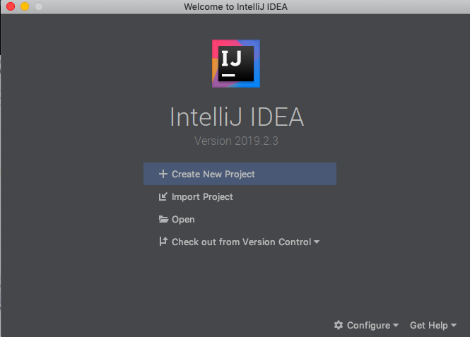

# Springboot-helloworld
##### 作者:coresu  
##### 时间:2019-20-24    
#


### 第一次学习springboot，首次创建项目总结起来一共四步走：  
1. 在IDLE中创建项目  
2. 经相关以来配置完毕  
3. 编写项目代码  
4. 测试运行  
##


### 第一步：创建一个项目   




### 第二步：导入相关依赖  
由于我们本次项目采用maven仓库的方式，所以仅需在pom中导入相应的依赖便可。  
相应的依赖代码已经在springboot官网的quick start模块中给出，只需将所需内容粘贴至pom.xml文件中，等待编译器自动下载完毕后便可使用。

[官网文档依赖代码位置](https://docs.spring.io/spring-boot/docs/current/reference/html/getting-started.html#getting-started)


```xml

   <!-- Inherit defaults from Spring Boot -->
    <parent>
        <groupId>org.springframework.boot</groupId>
        <artifactId>spring-boot-starter-parent</artifactId>
        <version>2.2.0.RELEASE</version>
    </parent>

    <!-- Add typical dependencies for a web application -->
    <dependencies>
        <dependency>
            <groupId>org.springframework.boot</groupId>
            <artifactId>spring-boot-starter-web</artifactId>
        </dependency>
    </dependencies>

    <!-- Package as an executable jar -->
    <build>
        <plugins>
            <plugin>
                <groupId>org.springframework.boot</groupId>
                <artifactId>spring-boot-maven-plugin</artifactId>
            </plugin>
        </plugins>
    </build>

```
* spring-boot-starter-parent和spring-boot-starter-web构成springboot的主要依赖，依据这两个插件，这两个插件有分别依赖于其他插件（不在此赘述），springboot会对使用过程中的包进行自动配置。  
* spring-boot-maven-plugin插件用对项目使用Lifecycle生命周期函数对项目进行打包，成功后，便可仅适用{Java -jar 包名} 的方式运行起来整个项目。


### 第三步:编写程序代码  


- 主函数部分<==>项目入口
```java
package com.springbootfirst;


import org.springframework.boot.SpringApplication;
import org.springframework.boot.autoconfigure.SpringBootApplication;


/**
 * @SpringBootApplication是一个主程序的注解，来标注一个主程序说明这是一个springboot应用
 */

@SpringBootApplication
public class HelloWorldMainApplication {
    public static void main(String[] args) {
        /*
        来启动主程序
         */
        SpringApplication.run(HelloWorldMainApplication.class, args);
    }
}

```


- 控制器部分
```java

package com.springbootfirst.controller;


import org.springframework.stereotype.Controller;
import org.springframework.web.bind.annotation.RequestMapping;
import org.springframework.web.bind.annotation.ResponseBody;


@Controller
public class HelloController {

    @ResponseBody
    @RequestMapping("/hello")
    public String hello(){
        return "hello world coresu!!";
    }
}

```


### 第四步:测试运行
> 在浏览器中访问：127.0.0.1:8080/hello 

> 在IDEA中测试运行，仅需鼠标右键运行主函数便可返回相应效果。  

> jar包部署，可以使用lifecycle中的生命周期函数，来给项目打包成jar包，打包成的jar中已经包含了Tomcat。Java -jar 项目所打成的jar包名后，浏览器地址访问。